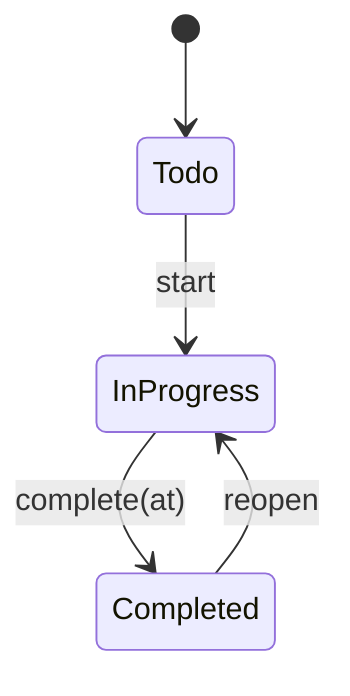

# Chapter 02 — State, Invariants, and Change

> **Status:** Approved
> **Part:** Part I — Thinking Like a Software Engineer
> **Prerequisites:** Ordinary application code, records or objects, and basic client/server/database concepts
> **Estimated study time:** 75–90 minutes for reading; 2–3 hours with exercises

## Why Change Is Where Correctness Breaks

At 10:03, Mara completes work item `WI-1842`, “Prepare customer export.” The item page immediately says **Completed**. The project dashboard still counts it as unfinished. A search-backed board view places it in the “In progress” column. An assistant, working from an older project summary, tells a manager that the item is blocked.

All four views look plausible. Together they contradict one another.

The defect is not that one Boolean was parsed incorrectly. The system has several representations of the same work, several paths that can change those representations, and no explicit account of which representation may resolve disagreement. An operator can patch the dashboard count, but cannot know whether that repairs the cause or merely hides one symptom. A manager may allocate duplicate work. A customer may receive a late export. Trust is lost through a collection of locally reasonable decisions.

Software becomes difficult not merely because it stores information, but because that information changes. Every change raises the same questions:

- What is true before the change?
- What is the actor trying to do?
- Is that change allowed now?
- What must be true afterward?
- Which boundary is responsible for accepting the result?
- Which other representations may lag, and how will they recover?

Field validation answers only a fraction of these questions. `status` may be a valid string and `completed_at` a valid timestamp while their combination is nonsensical. A function may produce a valid-looking result through a route the product forbids. A cache may contain structurally valid data that is no longer current.

This chapter develops a reasoning model for those failures. It does not yet teach the transaction, locking, messaging, or distributed-coordination mechanisms needed for harder boundaries. First, we need to say precisely what correctness over change means.

## Learning Objectives

By the end of this chapter, you should be able to:

- define state for a named purpose and boundary;
- distinguish domain identity, current value, runtime identity, and value equality;
- turn product rules into scoped invariants over accepted state;
- separate invalid states from forbidden transitions;
- describe a change using preconditions, effects, and postconditions;
- assign decision authority for a named fact without demanding one physical copy;
- evaluate computed and stored derivations by cost, staleness, and recovery;
- diagnose contradictions across frontend, backend, storage, asynchronous, and AI-assisted contexts;
- connect state-modeling decisions to user outcomes, operational work, and business risk.

## Start With the State You Are Reasoning About

**State** is the information needed, for a chosen purpose and boundary, to distinguish relevant situations at a point in time.

The qualifications matter. There is no useful inventory called “the state of the entire system” unless the question and boundary are clear.

For a work-item page deciding which actions to enable, relevant state might be:

```text
work_item_id = WI-1842
status = in_progress
assignee_id = U-73
completed_at = null
current_user_can_edit = true
```

For a project dashboard, the title may be irrelevant while the number of completed items matters. For an unsaved editing form, the user’s draft title is real state even though the backend has never accepted it. For an audit investigation, the current assignee is insufficient; the sequence of previous assignments matters.

“Everything stored” is therefore too broad. Logs and old exports can be stored without participating in the current decision. “Only mutable variables” is too narrow. A persisted row, a queued job, a feature configuration, and an observed response can all distinguish situations relevant to system behavior.

A practical state description names three things:

1. **Purpose:** Which question are we answering?
2. **Boundary:** Which component or workflow are we considering?
3. **Relevant facts:** Which information could change the answer?

This prevents arguments in which one engineer means browser state, another means persisted domain state, and a third means historical evidence.

### Candidate state and accepted state

An attempted change first produces a **candidate state**: a proposed result that has not necessarily been accepted. **Accepted state** is the result to which an accountable boundary has committed after evaluating a proposal under its declared rules and guarantees. It is eligible to serve as authoritative state for the facts that boundary owns. Consumers may rely on those facts when they obtain them through the authoritative contract; their local copies may still be stale or incomplete.

If the work-item service is responsible for accepting lifecycle changes, a browser’s optimistic update is a candidate. It can improve responsiveness, but it does not become authoritative merely because it is visible. The service may reject it because the item was already reopened, the user lacks permission, or a precondition no longer holds.

An invariant must hold for every accepted state within its explicitly declared scope. This does **not** mean it literally holds after every CPU instruction. A private implementation can temporarily pass through an inconsistent representation while assembling a result, but only if that representation:

- cannot escape its controlled boundary;
- cannot be observed or relied upon by other components;
- cannot become the accepted result when the operation fails.

For example, a private function might set `status` and then clear `completed_at` while constructing a reopened work item. That is acceptable only if no callback, shared reference, exception path, or returned result can expose the half-updated form. Mutating a shared object in two steps and hoping the second step runs is a different design.

> **Mental model:** “Always” means every accepted state in the declared scope—not every invisible implementation step and not every stale copy everywhere.

## Identity, Value, and Aliasing

The item’s title changes from “Prepare export” to “Prepare customer export.” Is it still the same work item? In the teaching model, yes: its **domain identity** is `WI-1842`, which supplies continuity across changes.

Identity answers “which continuing thing is this?” A **value** describes facts at a moment. Two snapshots of `WI-1842` can have the same domain identity but different values:

```text
before = { id: WI-1842, title: "Prepare export", status: todo }
after  = { id: WI-1842, title: "Prepare customer export", status: todo }
```

Conversely, two work items can have equal titles, assignees, and statuses while remaining different domain entities. Equal descriptions do not establish shared identity.

Two runtime distinctions add another axis:

- **Runtime or reference identity** asks whether two program expressions denote the same runtime object or shared underlying data.
- **Value equality** asks whether two values count as equal under a chosen comparison rule.

If `boardItem` and `dialogItem` refer to the same mutable object, changing one may be observable through the other. That is **aliasing**: more than one access path reaches shared mutable data. If they are distinct objects with equal fields, mutation of one does not by itself mutate the other, even though a value comparison may report equality.

Do not infer domain identity from runtime identity. A process restart can create a new runtime object for the same persisted work item. Do not infer value equality from runtime identity rules either. The comparison operation may be defined by a type, and equal values may live in distinct objects.

### A compact language translation

The mental model transfers, but the operators do not. Official language documentation supports these bounded claims:

| Language | Identity and equality relevant to this chapter | Aliasing consequence |
|---|---|---|
| TypeScript / JavaScript runtime | For ordinary JavaScript objects, strict equality succeeds when both operands are the same object value; separately allocated objects are not made equal by equal fields. | Assigning the same object to two variables gives two access paths to the same mutable object. |
| Python | Every object has identity, type, and value. `is` compares identity; equality behavior is type-defined. | Assignments can make names refer to the same mutable object; mutating it is visible through either name. |
| Ruby | `equal?` tests object identity. `==` is commonly overridden to express class-specific equality. | Two variables may designate the same mutable object even when the domain uses a different equality rule. |
| Go | Arrays and structs are self-contained values, while non-nil pointers, slices, maps, functions, and channels contain references to underlying data. Equality is type-specific; slices, maps, and functions are not generally comparable with `==` except to `nil` where allowed. | Copies of slices or maps can still share underlying data. Copying a struct copies its field values, but reference-bearing fields may still share underlying data. |

These statements come from the [ECMAScript equality algorithms](https://tc39.es/ecma262/multipage/abstract-operations.html#sec-isstrictlyequal), [Python data model](https://docs.python.org/3/reference/datamodel.html), [Ruby `Object` documentation](https://ruby-doc.org/core/Object.html), and [Go language specification](https://go.dev/ref/spec#Properties_of_types_and_values). Exact allocation, representation, and runtime behavior belongs to Chapter 05, Runtime Fundamentals.

The durable questions are language-independent:

- Does this operation update an existing shared representation or produce a replacement?
- Which aliases can observe the change?
- Which comparison expresses domain meaning rather than runtime coincidence?
- Does the same domain entity retain identity across the change?

Immutability can simplify snapshot reasoning because previous values are not modified in place. Mutation can be efficient and clear inside a controlled boundary. Neither is a universal moral rule; the risk comes from untracked observation and uncontrolled change.

## Invariants Define Acceptable State

Return to the work-item contradiction. Suppose the product team adopts this deliberately simplified teaching model:

- `status` is one of `todo`, `in_progress`, or `completed`;
- current completion time describes the current lifecycle state;
- completing is allowed only from `in_progress`;
- reopening returns a completed item to `in_progress`;
- historical completions are preserved separately.

These are assumptions, not universal product rules. Another product might retain the last completion timestamp on a reopened item, allow direct completion from `todo`, or support several completion cycles in current state. Correctness begins by making the chosen policy explicit.

We can now name the chapter’s organizing model: a software system follows a path through a **constrained state space**. The state space contains the snapshots we can describe; invariants admit only some as accepted states; transitions constrain the routes between them; authority decides which proposed changes are accepted; derivations produce other representations.

```text
accepted state --permitted transition--> accepted state
       |                                      |
       +--------- invariants hold ------------+

authoritative facts --derivation--> views, indexes, counts, summaries
```

This is a reasoning frame, not a promise that every arrow is one atomic operation or that every component sees one global snapshot. Those stronger guarantees depend on boundaries and mechanisms developed later in the book.

For this model, the current-state invariant is:

```text
status = completed
↔
completed_at is present
```

The double implication means both directions must hold:

- if status is `completed`, `completed_at` is present;
- if `completed_at` is present, status is `completed`.

An **invariant** is a predicate that must be true for every accepted state within a declared scope. A predicate is simply a question that evaluates to true or false for a state. Here the scope is one accepted current work-item record.

| `status` | `completed_at` | Accepted? | Reason |
|---|---|---:|---|
| `todo` | `null` | Yes | Both sides of the completion equivalence are false. |
| `in_progress` | `null` | Yes | The item is not currently complete. |
| `completed` | timestamp | Yes | Both sides are true. |
| `completed` | `null` | No | Completed state lacks its required current completion time. |
| `todo` | timestamp | No | Completion time claims a current completion that status denies. |
| `in_progress` | timestamp | No | Current status and completion metadata conflict. |

Every field in the rejected rows can be individually well-typed. Types constrain individual values; invariants can constrain relationships among values.

### Scope is part of the claim

“An item is complete if and only if it has a completion time” is precise only after declaring which representation and time horizon it describes. It applies to the accepted **current state** in this model. It does not imply that every dashboard, search document, or offline client is instantly current. It does not erase the historical fact that an item was once completed.

History is stored separately as minimal transition records:

```text
{ item_id: WI-1842, transition: completed, occurred_at: 2026-07-13T10:03:00Z }
{ item_id: WI-1842, transition: reopened,  occurred_at: 2026-07-14T08:20:00Z }
```

After reopening:

```text
status becomes in_progress
completed_at becomes null
```

The current record answers “what is true now?” The transition history answers “what happened previously?” Keeping both does not require event sourcing, nor does this chapter assume the current record is reconstructed from the history. It merely avoids forcing historical facts into fields whose purpose is current state.

In this teaching model, preserving the corresponding history record is part of the logical contract for completing and reopening. An implementation must choose an acceptance boundary strong enough that a failed operation cannot silently leave an accepted current state without its required history. The mechanism for establishing that guarantee is deferred to later chapters; the modeling decision comes first.

Invariants can have different scopes: one value, one record, several records, or a workflow spanning components. The wider the scope, the harder it may be to establish and preserve the predicate. This chapter states the desired guarantee; Chapters 07, 16, and 20 later examine overlapping changes, database coordination, and distributed boundaries.

### Invariant, validation rule, and goal

Not every desirable statement is an invariant.

- “Titles are at most 200 characters” may be an input and accepted-state rule.
- “Every accepted current work item belongs to one project” may be an invariant in this simplified model.
- “Search reflects accepted changes within 60 seconds” is a convergence target or service expectation, not a predicate required of every search snapshot.
- “Most work completes within a week” is a product or operational goal.

Calling all four “invariants” hides different enforcement and failure semantics. An invariant divides accepted from rejected state. A goal can be missed without making the underlying work item invalid.

Stronger invariants eliminate ambiguity, but they have costs. Existing data must satisfy them. Imports and migrations need a policy for incomplete records. Future product changes may invalidate today’s certainty. Before promoting a rule to an invariant, ask whether the business would truly reject every violating state or merely prefer it not to occur.

## Change Is More Than Assignment

A **mutation** is an implementation-level modification to a representation. A **state transition** is the domain-level movement from one state to another. One transition may use several mutations; one mutation may have no valid domain meaning.

Generic setters disperse the rules:

```text
set_status("completed")
set_completed_at(now)
```

Which call must run first? What if the second fails? Can another caller invoke only one? Can `todo` jump directly to `completed`? The code exposes storage operations while leaving the domain transition implicit.

A named transition makes the reasoning unit explicit:

```text
complete(item, at)
precondition: item.status = in_progress
effect:       status becomes completed
              completed_at becomes at
              append a completed history record
postcondition: status = completed
               and completed_at is present
               and the completed history record exists
```

The vocabulary of **precondition**—what must be true before an operation—and **postcondition**—what it guarantees if it succeeds—has a formal lineage in program reasoning, notably C. A. R. Hoare’s [“An Axiomatic Basis for Computer Programming”](https://doi.org/10.1145/363235.363259). We use the vocabulary here as a practical design aid, not as a formal proof system.

A command such as “complete this item” expresses intent. The transition evaluates that intent against accepted state. In this teaching model, the accepted result includes a history record stating the fact “the item was completed.” Keeping intent, decision, and historical fact distinct makes rejection and repair easier to reason about.

### A diagram for intuition

The simplified lifecycle is small enough to see at a glance:



The diagram emphasizes reachability and the overall shape of the workflow. It quickly reveals that no transition returns to `todo` and that direct `todo` → `completed` is not modeled.

### A table for precision

The same workflow can be examined more rigorously in a transition table:

| Current status | Command | Allowed? | Resulting status | `completed_at` effect | History effect |
|---|---|---:|---|---|---|
| `todo` | `start` | Yes | `in_progress` | remains `null` | append `started` |
| `todo` | `complete(at)` | No | — | — | none |
| `todo` | `reopen` | No | — | — | none |
| `in_progress` | `start` | No | — | — | none |
| `in_progress` | `complete(at)` | Yes | `completed` | set to `at` | append `completed` |
| `in_progress` | `reopen` | No | — | — | none |
| `completed` | `start` | No | — | — | none |
| `completed` | `complete(at)` | No | — | — | none |
| `completed` | `reopen` | Yes | `in_progress` | set to `null` | append `reopened` |

The table is less immediate visually, but better for finding missing cases and stating side effects. The diagram and table are not rivals: use the diagram to build intuition and the table to examine completeness. Neither captures every domain rule. Permission, concurrency, failure, and reasons for reopening may still matter.

### Invalid state versus forbidden transition

These are different defects:

- `status = completed` with `completed_at = null` is an **invalid state** in this model.
- Moving from `todo` directly to a well-formed completed state is a **forbidden transition**. The resulting snapshot satisfies the current-state invariant, but the route violates lifecycle policy.

Snapshot predicates cannot express all rules about history. Conversely, a permitted command may fail because its precondition is false by the time the authority evaluates it. A stale browser can request `complete`, but if the accepted item is already `completed` or no longer `in_progress`, rejection is correct even if the request was reasonable when the page loaded.

This is why “validate the final fields” and “allow only named transitions” solve related but non-identical problems.

The diagram and table describe normal operation beginning from valid accepted state. Repair and migration operations may instead begin with legacy state that violates the current model. They still need explicit preconditions, an accountable boundary, and a postcondition that establishes the intended valid state; silently routing corrupted data through ordinary transitions can conceal rather than repair it.

## Authority and Derived State

When the item page, dashboard, search index, and assistant disagree, which one wins?

An **authoritative source for a named fact** is the representation allowed to resolve disagreement about that fact. The **decision authority** is the boundary responsible for accepting changes to it. In the simplified system, the work-item domain boundary accepts lifecycle transitions, and its persisted current record is authoritative for current `status` and `completed_at`.

The common phrase **single source of truth** is useful shorthand, but misleading when interpreted literally. It does not require one physical database or forbid copies. A robust system may legitimately have:

- browser working state for unsaved edits;
- replicated copies of accepted records;
- caches optimized for reads;
- search projections optimized for queries;
- project summaries derived from many items;
- an assistant’s temporary context assembled for one task.

Different boundaries may also be authoritative for different facts. The identity service may decide a user’s current account status while the project system decides work-item status. Authority concerns which representation may resolve disagreement, not which machine stores every byte.

Permission and authority are also distinct. A user may be authorized to **request** completion. The accepting boundary remains responsible for deciding whether the transition is valid against current state.

### Derived state creates a contract

**Derived state** is a representation whose value can be obtained from other facts by a declared rule. Examples include:

- `is_completed`, derived from `status`;
- a project’s completed-item count, derived from its work items;
- a board column, derived from lifecycle status;
- a search document, derived from current item fields;
- an assistant summary, derived from retrieved project facts and a summarization process.

Derived does not mean disposable in every practical sense. Rebuilding a large search projection can be slow, expensive, or unable to reproduce the exact wording of an old nondeterministic summary. It means the representation is not permitted to overrule its named authoritative inputs without a separate product decision.

The safest default for a cheap derivation is often to compute it when read. Storing a derivation can be justified when reads are frequent, computation is costly, latency matters, or a snapshot must be preserved. The stored derivative then carries obligations:

| Question | Project completed count example |
|---|---|
| Authoritative inputs | Accepted current statuses of work items in the project |
| Derivation rule | Count items whose status is `completed` |
| Update trigger | Each accepted status transition or a periodic rebuild |
| Acceptable lag | Perhaps seconds for a dashboard; perhaps none for a billing decision |
| Detection | Compare sampled or scheduled recomputation with stored count |
| Recovery | Recompute from authoritative work-item state |
| Rule version | Record when changed semantics would produce a different count |
| Reproducibility | Exact for this deterministic count; other derivatives may be equivalent-but-not-identical or require preserving the original artifact |

This is the cost of intentional duplication. “Never duplicate data” is too crude. The useful rule is: every stored derivation needs named authority, synchronization expectations, and a repair path.

### One model across five contexts

The concepts remain stable while their local meaning changes:

| Context | Candidate or accepted state | Decision authority for lifecycle status | Typical divergence |
|---|---|---|---|
| Frontend | Unsaved edits and optimistic UI are candidate or local working state. | The domain boundary receiving the command | Local `isCompleted`, item cache, and board column are updated separately. |
| Backend domain model | A command is evaluated against the current accepted item. | The model or service accountable for lifecycle rules | Generic field updates bypass named transitions. |
| Relational storage | A persisted row represents accepted current facts in this simplified boundary. | The application/storage boundary as deliberately designed | Individually valid columns form an invalid combination; a summary row lags. |
| Asynchronous workflow | Jobs represent work still to perform; projections are downstream copies. | The work-item boundary, not the job or consumer | Search and notifications lag or repeat after partial failure. |
| AI-assisted system | Prompt, memory, plan, and retrieved context are bounded working state. | The domain tool that validates and accepts the requested transition | Stale context produces a plausible proposal that must not become an unchecked write. |

The table does not prescribe a framework. It shows the transfer: distinguish proposal from acceptance, name authority per fact, preserve local invariants, and treat downstream copies according to an explicit lag and recovery contract.

## Diagnosing Divergence

Consider the completion of `WI-1842` as an execution trace:

```text
10:03:00  work-item transition accepted as one logical result:
          status = completed, completed_at = 10:03:00,
          completed history record exists
10:03:02  project-count update fails
10:03:05  search projection still shows in_progress
10:03:10  notification attempt times out
10:04:00  retry sends notification
10:04:03  original attempt's response arrives; a second notification appears
```

The current work-item state can still satisfy its local invariant while the system produces contradictory observations. Calling the entire trace “an invariant violation” would blur several different obligations.

### Duplicated independent-looking fields

Suppose the item stores `status`, `is_completed`, and `completed_at`, and different handlers update different subsets. The API filters on `is_completed`; the page renders `status`; reporting checks `completed_at`.

The hidden assumption is that three writers will preserve one logical fact. Detection may come from impossible-combination queries or disagreement metrics. Recovery might remove `is_completed` and derive it, or preserve it for performance but establish one update boundary plus reconciliation. Deleting a field in production without checking consumers and existing data is not a repair plan.

### Stale stored derivation

The project count failed to update. That may be acceptable for a dashboard promised to converge within a minute, but unsafe if billing releases funds when the count reaches a threshold.

The hidden assumption is not merely “copies stay synchronized.” It is “all consumers tolerate the synchronization policy.” Detection requires comparing the stored count with a recomputation or tracking projection lag. Recovery is possible because authority and derivation are known. If nobody can name either, operators are reduced to guessing.

### Invalid accepted combination

A generic patch accepts `status = completed` without `completed_at`. The product now has no unambiguous answer to when completion occurred.

The violated assumption is that all write paths enforce the equivalence. Detection can scan accepted records using the invariant predicate. Repair needs a business rule: infer a timestamp from reliable history, revert the status, or flag the item for human resolution. Inventing a timestamp merely makes the row structurally tidy.

### Partially applied effects

The item is valid, but search is stale and notifications duplicate. These effects do not automatically belong inside the current-item invariant. Some may be allowed to lag; others may require eventual recovery or deduplication.

The hidden assumption is that one successful handler implies all downstream effects succeeded exactly once. Real systems need explicit evidence of pending work, success, failure, and retry identity. Chapter 18, Asynchronous Work, Queues, and Messaging, owns the mechanisms. Here the state model contributes the essential diagnosis: name the accepted core change, classify every other effect, and state its recovery obligation.

### Too many decision makers

Imagine three write paths:

```text
UI:         patch status and completed_at from its local cache
automation: patch status after evaluating a rule on an older snapshot
assistant:  write fields inferred from retrieved project context
```

All three may have permission to request a change, but none should independently declare what the accepted result is. Their snapshots can be stale, and their code can encode different transition rules.

A narrower design lets each actor submit a named intent to the same accountable boundary. That boundary evaluates current preconditions and either accepts a new state or explains rejection. If requests overlap, choosing a winner requires concurrency and transaction reasoning deferred to Chapters 07 and 16. The present improvement is still substantial: disagreement has one place to be decided instead of three accidental winners.

### State-change review

When a feature or incident involves contradictory data, write down:

1. The decision being made and its boundary.
2. Relevant current facts and relevant historical facts.
3. Domain identity and any runtime aliases relevant to the failure.
4. Invariants as predicates over accepted state, with explicit scope.
5. Named transitions, preconditions, effects, and postconditions.
6. Decision authority for each consequential fact.
7. Every copy or derivation, including its update trigger and acceptable lag.
8. Detection and recovery when a derivative or effect diverges.
9. Guarantees that remain unresolved without concurrency, transaction, or distributed-system mechanisms.

This list is more useful than beginning with “Which state-management library should we use?” It identifies the problem that any mechanism must solve.

## Trade-offs and Proportionate Design

The goal is not maximum machinery. It is a model strong enough for the consequences of being wrong.

### Named transitions or guarded CRUD?

Named transitions concentrate preconditions and effects, make forbidden routes visible, and create useful audit language. They add ceremony. If a note has only an editable title and no meaningful lifecycle, a `rename` function with a simple guard may be clearer than a state-machine abstraction.

Use explicit lifecycle modeling when routes, side effects, rejection reasons, or historical questions matter. Do not create a status enum merely to make ordinary edits look architectural.

### Compute or store a derivation?

For a project with 20 items and modest traffic, computing a completion count when read may be simplest. For a portfolio dashboard aggregating millions of items under a tight latency target, a stored projection may be justified.

The latter trades write/recovery complexity for read performance. Its appropriateness depends on workload, acceptable staleness, consequence of error, and rebuild cost—not on a slogan about normalization or caching.

### Mutation or replacement?

Building a replacement value can make before/after states explicit and reduce aliasing surprises. Controlled mutation can avoid copying and express a local algorithm directly. Mutation becomes dangerous when intermediate forms escape, failures leave partially changed accepted objects, or aliases obscure who observes the change.

Choose the representation after identifying the boundary. “Never mutate” is no more defensible than “mutation is always cheaper.”

### More invariants or more product flexibility?

An invariant rejects ambiguity early. It also constrains imports, migrations, experiments, and future policy. A team exploring a new workflow may not yet know whether `todo` → `completed` should be forbidden. Encoding guesses as permanent lifecycle law creates delivery cost later.

Separate genuine contradictions from preferences. Preserve the strongest rule the business can defend, and treat weaker expectations as validation warnings, goals, or telemetry until the policy stabilizes.

### One authority or one physical store?

Fact-level authority makes disagreement resolvable. It does not require a monolith or one database for the organization. Replicas and bounded ownership can be necessary for scale, availability, autonomy, or legal constraints. They increase the coordination burden, which later chapters address.

The chapter’s claim is narrower: for every consequential disagreement, engineers need to know which boundary is allowed to decide—or explicitly acknowledge that no immediate single answer exists.

## Production, Product, and Business Consequences

A state model becomes operational when failure is detectable and repairable.

Useful production evidence includes accepted and rejected transition counts, rejection reasons, invariant scans at important boundaries, projection lag, derivation mismatches, and repair outcomes. History should record enough provenance to answer who or what requested a transition, what was accepted, and when, subject to privacy and retention requirements. A repair tool should invoke the same rules as ordinary changes or clearly record why it bypassed them.

Changing an invariant also changes the treatment of old data and mixed software versions. If a new release requires every completed item to have a completion time, existing exceptions need an explicit migration policy. Chapter 26, Delivery, Deployment, and Safe Change, develops that problem; adding a check without examining existing state is not safe change.

From a product perspective, lifecycle rules determine which actions users see, which rejections they must understand, and how stale information is communicated. A dashboard that may lag for 30 seconds can be honest about its freshness. A destructive action based on that dashboard may need a fresh authoritative check. The same derivative can be appropriate for one interaction and dangerous for another.

The business consequences are direct: contradictory status creates duplicate work, missed commitments, support load, incorrect reporting, and loss of trust. Conversely, over-engineering a trivial state model delays learning and increases maintenance cost. Senior judgment connects the strength of the guarantee to the cost of error, the frequency of change, and the organization’s ability to operate the chosen design.

## Connections to Later Chapters

Chapter 03, Abstraction, Modularity, and Boundaries, asks where transition rules should live and which details a boundary should hide. Chapter 05 explains runtime representations beneath values, references, and mutation. Chapters 07 and 16 address overlapping changes and preservation of related invariants under concurrency. Chapter 13 expands identity, history, and ownership into domain modeling. Chapter 18 handles work continuing after an accepted transition, while Chapter 19 develops cache and staleness policy. Chapter 24 turns invariants and transition models into systematic verification.

Those chapters add mechanisms. The reasoning frame remains: name the state, constrain accepted snapshots, constrain routes, assign authority, and account for derivatives.

## Exercises

### Explain — Four kinds of sameness

You are given these observations:

```text
Snapshot A: { id: WI-7, title: "Export", status: todo }
Snapshot B: { id: WI-7, title: "Export", status: in_progress }
Snapshot C: { id: WI-9, title: "Export", status: todo }

Object x and object y contain fields equal to Snapshot A.
Variables p and q both access the same mutable object containing Snapshot A.
```

Explain which pairs share domain identity, which have equal described values, which definitely share runtime identity, and where a mutation can be observed through an alias. State any language-dependent assumptions.

**Self-check:** A strong answer does not derive domain identity from an equal title, distinguishes `x`/`y` from `p`/`q`, and avoids claiming that every language uses the same equality operator.

### Explain — Turn policy into an invariant

Under the chapter’s teaching assumptions, write the completion rule as a predicate. Enumerate all accepted and rejected combinations of these fields:

```text
status ∈ {todo, in_progress, completed}
completed_at ∈ {null, timestamp}
```

Then explain what happens to current state and history when a completed item is reopened. Finally, name one plausible product policy that would require changing the invariant.

**Self-check:** A strong answer handles both directions of the equivalence, keeps past completion in history rather than current `completed_at`, and labels the rule as model-specific.

### Diagnose — The contradictory dashboard

Use this trace:

```text
1. At 10:03, the authoritative work-item boundary accepts one logical result containing consistent current status, completed_at, and the required transition-history record.
2. Updating completed_item_count fails.
3. Search applies the update 45 seconds later.
4. A notification retry produces two emails.
```

For each observation, classify it as authoritative current state, historical fact, stored derivation, or side effect. Decide which local invariant is satisfied, which expectations are violated, what lag could be acceptable, and what evidence and repair operation are needed.

**Self-check:** A strong answer does not call every delayed copy an invalid work item. It gives different tolerances to display, consequential decisions, and notifications, and derives repair from named authority.

### Diagnose — Three writers

The UI, an automation rule, and an assistant each read a work item at different times. Each can patch `status` and `completed_at` directly. The UI requests completion, automation requests reassignment, and the assistant requests reopening.

Identify authority ambiguity, candidate forbidden transitions, and information that may be stale. Propose a narrower change boundary without claiming to solve simultaneous requests. Explain which remaining question belongs to concurrency or transaction design.

**Self-check:** A strong answer preserves all three actors’ ability to propose intent, gives none of their local snapshots automatic authority, and does not hand-wave how overlapping accepted changes are ordered.

### Design — Transfer to reservations

A reservation can be `proposed`, `held`, `confirmed`, `expired`, or `cancelled`. State assumptions about time and cancellation, define at least three scoped invariants, draw allowed transitions, and identify authoritative and derived facts. Define the inputs to resource availability—including reservations, capacity, maintenance, blackout periods, or policy where relevant under your assumptions—then explain what cannot be guaranteed about overlapping holds without concurrency control.

**Self-check:** A strong answer distinguishes reservation status from availability, makes time assumptions explicit, and does not pretend a diagram alone prevents two clients from claiming the same resource.

### Extend — Rebuildability after corruption

Project counts, search documents, and assistant summaries are discovered to be corrupt. Design the minimum provenance and operational controls needed to rebuild each. Include authoritative inputs, derivation-rule versions, rebuild scope, validation, and a policy for outputs that cannot be reproduced exactly.

**Self-check:** A strong answer notices that deterministic counts and search fields differ from generated summaries, and that rebuilding with a changed rule may not reproduce the historical output.

## Mastery Checklist

You should be able to answer these without notes:

- [ ] Given a feature, can I name the purpose, boundary, and minimal relevant state?
- [ ] Can I separate candidate state from state accepted by an accountable boundary?
- [ ] Can I distinguish domain identity, value equality, runtime identity, and aliasing?
- [ ] Can I state each invariant as a predicate and declare its scope?
- [ ] Can I generate both valid and invalid examples that test the predicate in both directions?
- [ ] Can I explain why an invariant need not hold after every private implementation step?
- [ ] Can I model a change with preconditions, effects, and postconditions?
- [ ] Can I identify a valid snapshot reached through a forbidden transition?
- [ ] Can I use a state diagram for reachability and a transition table to expose missing cases?
- [ ] Can I separate current state from historical facts?
- [ ] Can I name the decision authority for each consequential fact without demanding one physical copy?
- [ ] For every stored derivation, can I name inputs, rule, trigger, lag, detection, and rebuild path?
- [ ] Can I distinguish a stale derivative, a failed side effect, and an invalid accepted state?
- [ ] Can I choose proportionate enforcement instead of reflexively demanding immutability, a formal state machine, or zero duplication?
- [ ] Can I identify which guarantees require later concurrency, transaction, messaging, or distributed-systems mechanisms?
- [ ] Can I explain the user, operational, delivery, and business consequences of the chosen model?

## Key Takeaways

- State is relevant information for a named purpose and boundary, not merely everything stored.
- Accepted state is the result to which an accountable boundary has committed under its declared rules and guarantees. Invariants apply to every accepted state in their declared scope, while downstream copies may still be stale.
- Domain identity, value equality, runtime identity, and aliasing answer different questions.
- Invariants constrain snapshots; transitions constrain routes. A valid state can still be reached by a forbidden transition.
- Current state describes what is true now. History preserves what happened before.
- Authority is assigned per fact. Multiple legitimate copies can exist, but disagreement needs an explicit decision rule.
- Stored derivations trade read cost for synchronization and recovery obligations; duplication is a design choice, not an automatic defect.
- Strong state modeling makes contradictions diagnosable, but enforcement strength should match the consequence of error and the maturity of the product rule.

## Further Study

- C. A. R. Hoare’s [“An Axiomatic Basis for Computer Programming”](https://doi.org/10.1145/363235.363259) is the foundational source for reasoning with assertions, preconditions, and postconditions.
- The [ECMAScript specification](https://tc39.es/ecma262/multipage/abstract-operations.html#sec-isstrictlyequal), [Python data model](https://docs.python.org/3/reference/datamodel.html), [Ruby `Object` documentation](https://ruby-doc.org/core/Object.html), and [Go language specification](https://go.dev/ref/spec#Properties_of_types_and_values) give authoritative details for the language distinctions summarized here.
- Chapter 05, Runtime Fundamentals, will connect values, references, aliasing, and mutation to execution and memory behavior.
- Chapter 24, Testing and Verification, will develop techniques for testing invariants and transition systems rather than merely checking example outputs.
