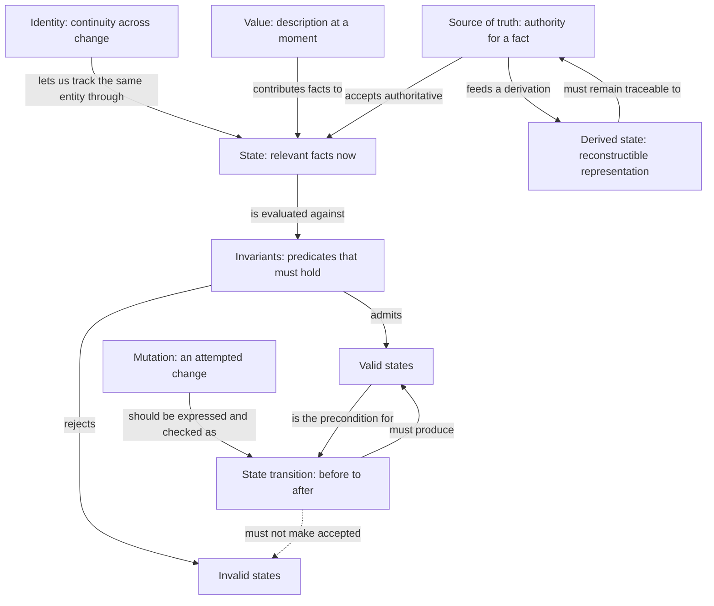

# Chapter 02 — State, Invariants, and Change: Architecture Review

> **Status:** Planning  
> **Part:** Part I — Thinking Like a Software Engineer  
> **Planning date:** 2026-07-13  
> **Blueprint core question:** What must always remain true, regardless of how the system changes?  
> **Plan quality score:** 4.25/5  
> **Chapter file:** Not created; drafting is outside this phase

## Planning Decision

The chapter should teach readers to see software as a sequence of state snapshots constrained by rules, rather than as a collection of functions that happen to update fields. Its central move is from asking “what values do we store?” to asking “which states are admissible, which transitions are allowed, who has authority to accept a change, and which other representations can be reconstructed?”

This is a Pass A conceptual-structure record. It evaluates the proposed architecture, not unwritten chapter prose. No chapter is approved by the scores in this file.

## Chapter Purpose

Establish the foundational vocabulary and reasoning method used throughout the book for changing systems safely. The chapter will distinguish identity from value, state from derived representations, and mutation from a valid state transition. It will show that correctness over time depends on making invariants explicit, constraining transitions, and assigning authority for each fact.

The practical aim is to help a reader inspect a feature or incident and answer:

- What facts describe the system now?
- Which facts identify a continuing entity, and which describe its current value?
- Which combinations are valid, and what must never be observable as accepted state?
- Which operations may move the system from one valid state to another?
- Which data is authoritative, and which data is a derived view or projection?
- What can fail between the intent to change state and the change becoming fully effective?

This chapter is foundational rather than exhaustive. Later chapters will supply the database, concurrency, distributed-systems, and reliability mechanisms that enforce these ideas under harder operating conditions.

## Assumed Reader Knowledge

The reader is expected to be an experienced mid-level engineer who can:

- read ordinary application code and simple pseudocode;
- recognize variables, records, objects, functions, and database rows;
- understand that an application handles requests or events and persists data;
- follow a small relational schema and a simple asynchronous job flow;
- distinguish, at a basic level, a client, server, database, and worker.

The chapter must not assume:

- formal methods, automata theory, or mathematical notation beyond sets and predicates explained in place;
- detailed knowledge of transactions, isolation levels, message delivery, or distributed consensus;
- familiarity with domain-driven design terminology;
- that Chapter 01 has already been drafted or read;
- one language’s object, reference, or equality semantics.

## Learning Objectives

By the end of the chapter, the reader should be able to:

1. Define state as the information needed, for a chosen purpose and boundary, to distinguish relevant situations at a point in time.
2. Distinguish stable domain identity, current value, in-memory reference identity, and value equality without treating them as synonyms.
3. Model an invariant as a predicate over accepted state and explain why validation at input boundaries alone does not preserve it.
4. Enumerate valid and invalid state combinations for a small domain model, including combinations that are individually well-typed but jointly contradictory.
5. Describe a change as a transition with preconditions, effects, and postconditions, and distinguish an invalid state from a disallowed transition.
6. Draw and critique a small state-transition diagram without assuming every domain requires a formal state-machine framework.
7. Identify authoritative state, derived state, caches, and projections, and state what event or rule keeps each derivative synchronized.
8. Diagnose duplicated state, stale derivations, partial changes, and ambiguous ownership from a concrete failure report.
9. Decide whether to store or compute derived state by reasoning about cost, staleness tolerance, recovery, and audit needs.
10. Propose a change boundary that preserves named invariants while acknowledging which guarantees require later mechanisms such as transactions or coordination.
11. Connect state-modeling choices to user-visible contradictions, operational recovery, delivery cost, and business risk.

## Primary Mental Model

> **Mental model:** A software system is a path through a constrained state space. State is a snapshot of relevant facts; invariants define the admissible snapshots; transitions define permitted changes; an authority accepts the resulting facts; derived state is a reconstructible view of those facts.

The chapter will introduce a compact reasoning frame:

```text
accepted state --permitted transition--> accepted state
       |                                      |
       +-------- invariants hold -------------+

authoritative facts --derivation--> views, caches, indexes, summaries
```

This is not a claim that all changes are atomic or that every system has one physical copy of data. It is a question set for finding where correctness lives and where it can be lost. Later chapters explain how concurrency, transactions, messaging, and distributed ownership complicate the arrows.

## Concept Map



Required distinctions to preserve in the prose:

- **State is relative to a purpose and boundary.** A browser tab, service, database, and business workflow may each track different relevant facts.
- **Identity is continuity, not all current attributes.** Changing a title does not necessarily create a new work item; replacing one immutable value may create a new value while preserving the entity’s domain identity.
- **Value and reference are separate axes.** Two references may denote the same mutable object; two distinct objects may have equal values. Language-specific semantics will be brief translations, not the chapter’s foundation.
- **Mutation is a mechanism; transition is a domain interpretation.** An assignment can mutate memory without representing an allowed business transition.
- **Invalid state and invalid transition differ.** A valid snapshot can still be reached by a forbidden route, and a permitted command can fail because its preconditions no longer hold.
- **An invariant is scoped.** It may apply within one object, one aggregate, one database, or a larger workflow; the enforcement mechanism and strength depend on that scope.
- **“Source of truth” means decision authority for a named fact.** It does not mean only one copy may exist, nor that one component is authoritative for every fact.
- **Derived state is not automatically bad.** Storing a derivation can be justified, but it creates a synchronization and recovery obligation.

## Candidate Recurring Examples

### Candidate A — Collaborative project-management work item

A work item has a stable identifier, title, assignee, lifecycle status, completion metadata, and project membership. Commands such as assign, start, complete, and reopen create transitions. Project completion counts, board columns, search documents, notifications, and AI-generated summaries are derived representations or effects.

Useful invariants can be explicit without being industry-specific: a completed item has a completion timestamp; a non-completed item does not; a work item belongs to exactly one project in this deliberately simplified model; only defined transitions change lifecycle status. The example naturally exposes stale progress counts, search lag, concurrent editing as a forward reference, partial audit/notification effects, and uncertainty over whether the database record, UI store, search index, or agent memory owns a fact.

Risk: simplistic workflow rules can look universal. The prose must label them as assumptions for this teaching model and show that another product could legitimately allow different states.

### Candidate B — Reservation or booking workflow

A reservation moves through proposed, held, confirmed, expired, and cancelled states. Resource identity persists while availability and reservation values change. Availability is often derived, and overlapping bookings offer a strong invariant.

Strengths: transitions and invalid combinations are vivid; business consequences are immediate. Weaknesses: time, exclusivity, concurrent claims, payment authorization, and distributed coordination quickly become central. Treating “no overlap” as locally enforceable would either mislead the reader or pull Chapters 07, 16, and 20 into Chapter 02.

### Candidate C — Order and payment workflow

An order and a payment each have an identity and lifecycle. Totals may be derived from line items; fulfillment eligibility depends on several facts; status fields can disagree after partial changes.

Strengths: duplicated totals, invalid combinations, and partially applied multi-system changes have obvious financial and user consequences. Weaknesses: an order and a payment are separate state machines, and rules such as “cancelled and paid is invalid” are often wrong because refunds and historical states matter. The example risks teaching an anemic status model or requiring extensive domain qualifications before the core model is secure.

### Example Evaluation and Selection

| Criterion | Project work item | Reservation | Order and payment |
|---|---:|---:|---:|
| Low prerequisite burden | 5 | 3 | 3 |
| Coverage of required concepts | 5 | 5 | 5 |
| Supports frontend through AI-agent views | 5 | 4 | 4 |
| Avoids premature concurrency/distribution detail | 5 | 2 | 2 |
| Clear product and production consequences | 4 | 5 | 5 |
| Reusable in later chapters | 5 | 5 | 5 |
| **Total** | **29/30** | **24/30** | **24/30** |

**Selected example: collaborative project-management work item.** It offers the broadest transfer surface with the least accidental domain complexity. The reservation and order/payment examples should appear as short contrast cases where they expose a limit of the primary example, not as parallel narratives.

## Proposed Chapter Structure

The eventual chapter should adapt the template into the following reasoning path. The headings are proposed, not chapter prose.

### 1. Why Change Is Where Correctness Breaks

- Open with a work item displayed as “In progress” in one screen, counted as complete in a dashboard, and summarized as blocked by an AI assistant.
- Establish the cost: users act on contradictions; operators cannot repair what has no clear authority; product rules leak across components.
- Pose the blueprint’s central question and explain why field validation is not enough.

### 2. Learning Objectives

- Present the concrete capabilities from this plan in a shortened reader-facing form.
- Emphasize explanation, diagnosis, and design rather than terminology recall.

### 3. The Constrained-State-Space Mental Model

- Introduce snapshot, predicate, transition, authority, and derivation in plain language.
- Use the compact diagram before naming state-machine tooling.
- State assumptions: one logical work item first; concurrency and distributed enforcement are previews.

### 4. What Counts as State?

- Define state relative to a question and system boundary.
- Separate input, current state, history, configuration, and observation where useful.
- Explain that “everything stored” is too broad and “only mutable variables” is too narrow for system reasoning.
- Apply the definition to a work item, browser editing form, backend record, database row, and worker job.

### 5. Identity, Values, and References

- Show a work item retaining identity while title, assignee, and status change.
- Contrast domain identity with value equality and reference identity.
- Explain immutable values versus mutable entities as modeling choices, not moral categories.
- Briefly translate aliasing and equality differences across TypeScript, Python, Ruby, and Go only where semantics change the reader’s reasoning.

### 6. Invariants Divide the Possible from the Permitted

- Derive invariants from contradictions the product cannot accept.
- Move from local type constraints to relationships among fields and entities.
- Distinguish always-required invariants from temporary workflow expectations and eventual goals.
- Show valid/invalid state tables for the simplified completion rule.
- Explain that stronger invariants reduce ambiguity but impose enforcement and change costs.

### 7. Change as a State Transition

- Model complete and reopen as named transitions with preconditions, effects, and postconditions.
- Distinguish commands/intents, events/facts, mutations/implementation steps, and transitions/domain meaning without turning this into an API or event-modeling chapter.
- Show why setters that permit arbitrary field combinations disperse correctness rules.
- Introduce a small state diagram and show when a transition table is clearer.

### 8. Derived State and Decision Authority

- Classify project completion count, UI filters, search documents, cached summaries, and AI context as derived or copied representations.
- Replace the slogan “single source of truth” with authority for a named fact.
- Compare compute-on-read, stored derivation, cache, and projection by cost, latency, staleness, and recoverability.
- Require every stored derivative to name its inputs, update trigger, acceptable lag, and rebuild/reconciliation path.

### 9. One Model Across Five Engineering Contexts

- Present a compact comparison across frontend, backend domain model, relational database, asynchronous workflow, and AI-agent system.
- Keep the primary concepts constant while showing that enforcement strength and failure modes change by boundary.
- Avoid five framework tutorials; use one table plus at most two short code/schema fragments if they add semantic value.

### 10. Failure Modes: When Representations Diverge

- Walk through duplicated state, stale derived state, invalid combinations, partially applied changes, and unclear authority.
- For each, identify the violated assumption, detection signal, user/business consequence, and recovery strategy.
- Separate prevention within one consistency boundary from reconciliation across boundaries.

### 11. Trade-offs and When Less Machinery Is Better

- Compare explicit state machines with simple guarded functions.
- Compare normalized authority with intentional duplication.
- Explain when computed derivations are preferable and when materialization is justified.
- Discuss the cost of over-constraining exploratory products or modeling incidental steps as permanent domain states.
- Reject universal prescriptions such as “never mutate,” “never duplicate,” and “every entity needs a state machine.”

### 12. Production, Product, and Business Consequences

- Production: audit trails, transition metrics, invariant-violation telemetry, repair tools, migrations, and rebuildability.
- Product: consistent user feedback, understandable lifecycle rules, conflict behavior, and acceptable staleness.
- Business: double work, lost trust, support load, compliance/audit exposure where applicable, and the delivery cost of changing an entrenched state model.
- Keep detailed observability, rollout, transaction, and security mechanisms as forward references.

### 13. Connections, Exercises, and Mastery

- Connect the model to later chapters without linking to files that do not yet exist.
- Include Explain, Diagnose, Design, and optional Extend exercises with evaluation criteria.
- End with a checklist that requires the reader to apply the full reasoning frame.
- Provide a selective further-study list whose cited entries are added to `references.md` only when used in the drafted chapter.

## Supporting Context Examples

These examples translate the same mental model; they should be brief and subordinate to the recurring example.

| Context | State and authority | Invariant or transition | Derived-state risk |
|---|---|---|---|
| Frontend systems | The server owns persisted work-item status; the client owns unsaved form edits and may hold an optimistic candidate state. | The Complete action should create a candidate transition and handle rejection, rather than independently declaring durable success. | Local `isComplete`, a cached work item, and a board-column list can disagree if each is updated separately. |
| Backend domain models | A work-item model or service applies complete/reopen rules to the current authoritative record. | `complete(at)` requires an allowed prior status and produces status plus completion metadata together. | A separately maintained `completed` boolean can drift from status and timestamp. |
| Relational databases | The database is authoritative for the persisted row within the simplified system boundary. | `CHECK` and `NOT NULL`-style constraints can reject some invalid combinations; transition history or cross-row rules need different mechanisms. | A stored project completion count can lag work-item rows and therefore needs an explicit maintenance and rebuild strategy. |
| Asynchronous workflows | The work-item change is authoritative for lifecycle status; a job/message records work still to perform, not a second owner of that status. | Completing an item may enqueue audit, notification, and search-projection work after the accepted transition. | Retries, duplicates, or a failed consumer can leave search and notifications behind even though the work item is valid. Detailed delivery guarantees are deferred. |
| AI-agent systems | The domain system remains authoritative; an agent’s prompt, memory, plan, and tool results are working state with bounded trust. | The agent should request a named domain transition through a tool whose preconditions are checked, not directly rewrite an inferred record. | Stale retrieved context can cause an invalid proposal; treating the agent transcript as authority creates unclear ownership and poor recovery. |

## Failure Scenario Plan

### Duplicated state

**Scenario:** A work item stores `status`, `is_completed`, and `completed_at`; separate handlers update different subsets. The board shows the item as complete while an API filter excludes it.

**Reasoning target:** Identify which facts are independent, which are derivable, what invariant relates them, and whether to remove duplication or enforce/reconcile it. Discuss migration risk rather than prescribing deletion in place.

### Stale derived state

**Scenario:** A project dashboard stores `completed_item_count`. A successful work-item transition is followed by a failed projection update, so progress and billing/reporting logic consume different values.

**Reasoning target:** Define acceptable staleness by consumer, make the source and derivation explicit, and design detection plus rebuild. Show why a derivative can be acceptable for display but unsafe for a consequential decision.

### Invalid state combinations

**Scenario:** The work item has `status = in_progress` and a non-null `completed_at`, or `status = completed` without one, because generic field updates bypass a transition.

**Reasoning target:** Separate type validity from domain validity, state the invariant as a predicate, identify enforcement boundaries, and consider whether the model’s assumption should instead change.

### Partially applied changes

**Scenario:** The item becomes complete, but its audit entry, search document, and notification do not all update. A retry later duplicates the notification.

**Reasoning target:** Separate the core invariant from secondary effects, identify what users may observe, and sketch recovery and idempotency needs while deferring mechanism depth to Chapters 16 and 18.

### Unclear ownership of the source of truth

**Scenario:** A user edits an item while an automation rule and an AI agent act from older snapshots. The UI cache, database, search index, and agent memory each contain a plausible assignee, and different components write back their version.

**Reasoning target:** Name authority per fact, distinguish proposal from accepted state, establish conflict or version rules at a conceptual level, and identify which copies must never become writers.

## Trade-offs the Draft Must Treat Explicitly

- Encapsulated named transitions concentrate rules but add ceremony and can become a rigid workflow abstraction for simple CRUD.
- More invariants prevent contradictory states but raise migration, integration, and product-change costs; an alleged invariant may merely be today’s policy.
- Immutability simplifies snapshot reasoning and reduces aliasing hazards, but copying and reconstruction can be awkward or expensive depending on runtime and data size.
- Mutation can be appropriate inside a controlled boundary; the important question is whether observers can see a broken intermediate state.
- Computing derived state avoids synchronization bugs but may cost latency or compute; storing it improves read paths while creating staleness, repair, and ownership obligations.
- A single logical authority simplifies conflict resolution, but physical replication and bounded ownership are often necessary. “One database for everything” is not the lesson.
- Explicit state-machine notation helps with constrained lifecycles; it can overfit flexible processes and hide richer domain rules behind a status enum.

## Explicit Scope Boundaries

The chapter will cover:

- conceptual state at object, application, and workflow boundaries;
- domain identity, value equality, and reference identity only far enough to prevent category errors;
- invariants as predicates and their relationship to valid states;
- named transitions, preconditions, effects, and postconditions;
- small finite state diagrams and transition tables as reasoning aids;
- authoritative facts, derived values, caches, and projections at a conceptual level;
- local versus cross-boundary failure consequences;
- brief examples across the five requested engineering contexts.

The chapter will not become:

- a formal-methods chapter with proofs, temporal logic, model checking, or exhaustive automata theory;
- a runtime memory chapter about stack/heap layout, pointers, garbage collection, or language-specific object models;
- a database implementation chapter about normalization, locking, isolation levels, or transaction syntax;
- a concurrency chapter about races, atomic instructions, locks, or compare-and-swap;
- a distributed-systems chapter about consensus, replication protocols, clocks, or global consistency;
- a messaging chapter about brokers, delivery guarantees, outboxes, sagas, or retry algorithms;
- a domain-driven design chapter about aggregates, bounded contexts, entities, value objects, or domain events in depth;
- a frontend state-management framework comparison;
- an AI-agent framework or prompt-engineering tutorial;
- an argument that all mutable state, duplicated data, or cached data is inherently wrong.

## Concepts Deferred to Later Chapters

| Deferred concept | Canonical later chapter | Chapter 02 treatment |
|---|---|---|
| Encapsulation and locating invariant ownership | Chapter 03 — Abstraction, Modularity, and Boundaries | Preview that change should pass through an accountable boundary. |
| Runtime object/reference and memory behavior | Chapter 05 — Runtime Fundamentals | Note that exact aliasing and representation semantics depend on the runtime. |
| Concurrent transitions, races, and atomicity | Chapter 07 — Concurrency, Parallelism, and Coordination | Show two candidate changes conceptually; defer coordination mechanisms. |
| API commands, validation, idempotency, and contracts | Chapter 10 — API Design and Evolution | Distinguish input validation from preserved invariants; defer protocol design. |
| Untrusted agent/request identity and authorization | Chapter 11 — Authentication, Authorization, and Trust | State that authority to decide a fact differs from permission to request a change. |
| Reconciliation with unreliable dependencies | Chapter 12 — External Integrations and Unreliable Dependencies | Name reconciliation as a need, not a detailed pattern. |
| Entities, value objects, aggregates, lifecycle, and domain events | Chapter 13 — Data Modeling and Domain Modeling | Provide prerequisite vocabulary without introducing the full pattern language. |
| Relational constraints, normalization, and schema design | Chapter 14 — Relational Databases and SQL | Use one conceptual constraint example; defer database design instruction. |
| Atomic multi-record updates and isolation | Chapter 16 — Transactions and Concurrency Control | Explain the desired guarantee and why local reasoning may be insufficient. |
| Durable jobs, delivery guarantees, deduplication, and outbox-style mechanisms | Chapter 18 — Asynchronous Work, Queues, and Messaging | Use partial effects as motivation only. |
| Cache policy and systematic staleness control | Chapter 19 — Caching and Managing Staleness | Establish authority/derivation vocabulary. |
| Replicated authority, consistency, coordination, and partial failure | Chapter 20 — Distributed Systems Fundamentals | Avoid promising a universal global snapshot. |
| Failure recovery and graceful degradation | Chapter 21 — Reliability and Designing for Failure | Introduce recoverability as a design question. |
| Invariant telemetry and debugging evidence | Chapter 22 — Observability and Systematic Debugging | Mention detection signals without teaching observability systems. |
| Property-based, model-based, and stateful testing | Chapter 24 — Testing and Verification | Use testable reasoning in exercises; defer methods and tooling. |
| Schema/data migrations and progressive rollout | Chapter 26 — Delivery, Deployment, and Safe Change | Note that changing invariants changes existing data and mixed-version behavior. |
| Agent evaluation and human ownership of decisions | Chapter 32 — Working Effectively With AI | Establish that agent working state is not automatically domain authority. |

## Exercise Designs

### Explain — One record, four kinds of sameness

Give two work-item snapshots, two in-memory objects with equal fields, and two references to one mutable object. Ask the reader to explain domain identity, value equality, reference identity, and state change in their own words.

**Evaluation:** A strong answer does not infer identity solely from equal values, does not assume references behave identically in every language, and names the purpose for which the state is relevant.

### Explain — Turn policy into an invariant

Provide the rule “completed work has a completion time” plus examples around reopening. Ask the reader to write the invariant as a predicate, list accepted and rejected combinations, and identify assumptions hidden in the word “completed.”

**Evaluation:** A strong answer handles both directions if the model requires them, distinguishes product policy from universal truth, and identifies when the timestamp should be cleared or retained as history.

### Diagnose — The contradictory project dashboard

Provide a trace in which the work-item row updates, the project count update fails, search is delayed, and a retry sends two notifications. Ask which state remains valid, which views are stale, which invariant is local, and which repair signals are needed.

**Evaluation:** A strong answer does not label every discrepancy an invariant violation; it separates authoritative state, derivatives, side effects, acceptable lag, and recovery.

### Diagnose — Too many writers

Show UI, automation, and agent pseudocode that each writes status and completion metadata directly from a different snapshot. Ask the reader to find authority ambiguity and forbidden transitions, then propose a narrower write path.

**Evaluation:** A strong answer assigns authority per fact, preserves proposals as distinct from accepted changes, and flags concurrency as a later coordination problem rather than hand-waving it away.

### Design — Reservation lifecycle transfer

Ask the reader to transfer the mental model to a reservation with proposed, held, confirmed, expired, and cancelled states. They must state assumptions, define at least three invariants, draw allowed transitions, name derived availability, and identify what cannot be guaranteed without concurrency control.

**Evaluation:** A strong answer notices time and overlapping claims, distinguishes reservation state from resource availability, and avoids inventing a globally atomic transition.

### Extend — Design for rebuildability

Ask the reader to design the minimum provenance and operational controls needed to rebuild project progress, search documents, and an AI summary after corrupted derived data is discovered.

**Evaluation:** A strong answer names authoritative inputs, deterministic or versioned derivations, scope of replay/rebuild, detection, and the limits of regenerating historical outputs from changed rules.

## Mastery Standard

The reader has mastered the chapter when, without notes, they can take an unfamiliar feature and produce a defensible state model that:

- names the system boundary and relevant facts;
- distinguishes identity, values, and references;
- states invariants precisely enough to generate valid and invalid examples;
- represents important changes as transitions with preconditions and postconditions;
- separates invalid snapshots from forbidden transitions;
- assigns decision authority for each consequential fact;
- identifies every stored derivative and explains its synchronization, staleness, and rebuild contract;
- predicts the observations created by partial application;
- chooses proportionate enforcement rather than automatically demanding immutability, a formal state machine, or one physical data store;
- explains user, operational, and business consequences;
- identifies which remaining correctness questions require concurrency, transactions, messaging, or distributed-systems knowledge.

The mastery checklist in the eventual chapter should use scenario questions that demonstrate these abilities, not requests to recite definitions.

## Research and References Plan

Most claims in this chapter are stable conceptual definitions and should be derived transparently rather than padded with citations. Research is needed where terminology varies, where a platform example makes an implementation claim, or where an original source adds intellectual value.

### Questions to verify during drafting

1. How should the book distinguish invariant, precondition, postcondition, safety property, and business rule without overstating formal equivalence?
2. Which minimum state-machine notation is standard enough to be recognizable but not dependent on UML semantics?
3. What precise claims can be made about language equality, aliasing, immutable values, and references in TypeScript/JavaScript, Python, Ruby, and Go?
4. Which relational constraints can enforce the simplified row invariant portably, and which examples are PostgreSQL-specific?
5. How do current official frontend sources describe avoiding contradictory or redundant state?
6. How should current AI-agent documentation distinguish session/conversation/working state from authoritative application data and tool-mediated writes?

### Candidate primary or authoritative sources

- C. A. R. Hoare, “An Axiomatic Basis for Computer Programming,” for preconditions, postconditions, and invariants.
- David Harel, “Statecharts: A Visual Formalism for Complex Systems,” for the motivation and limits of richer state representations; use only if the chapter actually discusses hierarchy or concurrency in diagrams.
- The current ECMAScript specification, Python language reference/data model, Ruby documentation, and Go language specification for language-specific identity, equality, mutation, and reference-like semantics.
- Current PostgreSQL documentation on constraints as one concrete database translation, clearly labeled as implementation-specific rather than universal SQL behavior.
- Current official React documentation on structuring state as a frontend example, cited only for React-specific guidance rather than as a universal rule.
- Current official documentation for any AI agent/tool API used in the supporting example. Because agent products evolve quickly, verify at draft time and avoid making a vendor API central to the mental model.

### Citation policy for the draft

- Prefer original papers, language specifications, and official project documentation.
- Cite near the implementation-specific or historical claim and add the complete entry under Chapter 02 in `references.md` only when the source is cited in chapter prose.
- Do not cite ordinary reasoning such as “a stored derivative can become stale” merely to make the chapter appear researched.
- Do not add references during this planning phase because no chapter claims cite them yet.

## Cross-Chapter Relationships

### Prior context

Chapter 01 is helpful for the distinction between programming and engineering, correctness beyond immediate execution, and software as a model. It is not required for this plan because no Chapter 01 draft exists. Chapter 02 must briefly establish any such vocabulary it needs and later remove duplication during the first cross-chapter review.

### Chapter 02 as a foundation

- Chapter 03 locates the boundary that owns and hides transitions and invariants.
- Chapter 05 explains the runtime representations beneath values, references, and mutation.
- Chapter 07 asks what happens when multiple transitions overlap against shared state.
- Chapter 10 turns transition intent and invariant feedback into API contracts.
- Chapter 13 expands identity, values, ownership, lifecycle, and invariants into domain modeling.
- Chapter 14 maps invariants and authoritative data into schemas and constraints.
- Chapter 16 supplies transaction and isolation mechanisms for preserving related invariants under concurrency.
- Chapter 18 handles effects that continue after the initiating transition.
- Chapter 19 studies stored derivations and acceptable staleness in depth.
- Chapter 20 challenges the assumption that one current global state is knowable.
- Chapter 24 turns invariants and transition models into verification strategies.
- Chapter 26 addresses changing state models and invariants safely in production.
- Chapter 28 reuses the full reasoning frame when designing systems.
- Chapter 32 applies authority, working state, and verification to AI-assisted engineering.

### Duplication and cross-reference policy

- Chapter 02 should own the canonical definitions of state, invariant, valid state, transition, derived state, and fact-level authority.
- Chapter 13 should own detailed entity/value-object/aggregate terminology and historical domain modeling.
- Chapter 16 should own atomicity and concurrent invariant preservation.
- Chapter 19 should own cache strategies and staleness policy.
- Until target chapter files exist, refer to future chapters by title in prose without creating broken Markdown links.
- Add glossary entries only during drafting, when final chapter wording becomes stable. Likely cross-book terms are state, invariant, state transition, derived state, and source of truth/authority.

## Risks and Open Editorial Questions

1. **Meaning of “always.”** The blueprint asks what must always remain true, but distributed workflows may temporarily diverge. The draft must define “accepted state” and invariant scope precisely enough that eventual convergence is not mislabeled as a momentary invariant.
2. **Source-of-truth terminology.** The common phrase invites a simplistic “one database” lesson. Should the chapter title the section “decision authority” and treat “source of truth” as the industry phrase being refined?
3. **Identity overload.** Domain identity, authentication identity, database keys, object identity, and reference equality are different. The draft must decide how much comparison is necessary before Chapter 05 and Chapter 11.
4. **History versus current state.** Clearing `completed_at` on reopen makes the teaching invariant simple but discards history. Should the primary example retain a transition log so the chapter can distinguish current state from historical facts without pulling in event sourcing?
5. **Invalid state versus transient implementation state.** Local mutations may temporarily break a predicate inside an unobservable change boundary. The draft needs language about what counts as observable or accepted without prematurely teaching transactions.
6. **State-machine depth.** A small diagram helps, but too much notation can imply that status enums fully model domain behavior. The draft should decide whether one transition table is more instructive than both a table and diagram.
7. **AI-agent example longevity.** Agent concepts are relevant, but APIs and terminology change rapidly. Keep the example conceptual and tool-mediated; verify any platform-specific statement immediately before drafting.
8. **Primary example continuity.** No approved chapters yet establish recurring domain rules. The simplified work-item assumptions must be recorded clearly so later chapters either reuse them or announce changes.
9. **Stored derivative taxonomy.** Cache, projection, replica, denormalized field, and materialized view overlap but are not interchangeable. Chapter 02 needs enough distinction to prevent confusion while leaving mechanisms to later chapters.
10. **Exercise answer guidance.** The final chapter needs evaluation cues or a future answer format so open-ended exercises are verifiable without turning the chapter into a workbook.

None of these questions blocks human review of the architecture. Questions 1, 2, 4, and 5 should be resolved before drafting prose because they affect the chapter’s central vocabulary.

## Technical Accuracy Concerns to Resolve During Drafting

- Avoid saying an invariant literally holds at every CPU instruction; define the relevant accepted/observable boundary.
- Avoid implying that a finite status enum captures all state or that every transition is deterministic.
- Avoid implying that database constraints can express or atomically preserve every domain invariant.
- Avoid using “reference” as a portable language primitive; exact semantics differ among JavaScript/TypeScript, Python, Ruby, and Go.
- Avoid describing asynchronous side effects as part of one atomic change unless a specific mechanism and boundary justify it.
- Avoid treating an AI agent’s memory, transcript, or generated summary as authoritative merely because it is persistent.

## Strongest Parts of the Proposed Architecture

- One mental model unifies all blueprint topics without depending on a framework.
- The selected example travels naturally across frontend, backend, database, asynchronous, and AI-agent contexts.
- Failure scenarios tie abstract distinctions to observable production and business consequences.
- Scope boundaries explicitly protect later chapters on concurrency, data modeling, transactions, messaging, caching, and distributed systems.
- Exercises test transfer and diagnosis, including cases where the correct answer is to qualify the invariant or defer a guarantee.

## Weaknesses Found

- No prose or code exists yet, so clarity, pacing, and implementation accuracy remain predictions.
- The primary invariant is intentionally simple and may feel artificial unless the draft acknowledges history and alternative product rules.
- The plan covers many contexts; the draft could become survey-like if the cross-context comparison expands beyond one compact section.
- “Accepted state,” “observable state,” and “authority” require careful definitions that are not yet standardized in the glossary.
- The research plan names candidate sources, but source selection and claim-level verification remain undone by design.

## Revision Actions Completed in This Planning Phase

- Chose a single recurring example after evaluating three candidates.
- Reframed “single source of truth” as authority for a named fact.
- Added explicit distinctions between invalid state and invalid transition, and between mutation and transition.
- Bounded concurrency, transaction, messaging, caching, distributed-systems, and AI-framework detail.
- Added scenario-based exercises with evaluation criteria.
- Added plan-specific evidence, weaknesses, and improvements for all twelve rubric criteria.

## Quality-Rubric Evaluation of the Plan

These scores assess whether the architecture is likely to produce a strong chapter. They are not final chapter scores and cannot support approval.

| Criterion | Score | Evidence in the plan | Weakness | Recommended improvement before or during drafting |
|---|---:|---|---|---|
| Accuracy | 4/5 | The plan distinguishes scoped invariants, accepted state, authority, derivation, invalid states, and invalid transitions; it records implementation-dependent claims for verification. | Definitions and language/database/agent examples have not yet been validated at claim level. | Resolve the six research questions with primary sources and record precise assumptions beside every implementation-specific example. |
| First principles | 5/5 | The progression begins with relevant facts and contradictions, derives valid states from predicates, then derives transitions, authority, and synchronization obligations. | The formal frame could feel abstract if introduced before the opening contradiction has earned it. | Draft the incident first, then introduce notation incrementally and return to the same observations after each concept. |
| Transferability | 5/5 | The same model is mapped across five requested contexts and avoids reliance on a language, database, framework, or vendor. | Breadth can become shallow translation if every context receives equal prose. | Keep one canonical example and use a compact comparison to expose only meaningful semantic differences. |
| Practicality | 4/5 | Failure traces, decision questions, transition design, derivation contracts, and rebuild considerations are directly usable in feature and incident work. | The plan does not yet include a reusable worksheet or worked end-to-end analysis. | Include a concise “state review” question set and one complete worked diagnosis in the draft. |
| Trade-offs | 4/5 | It rejects universal rules and plans explicit comparisons for mutation, invariants, state machines, stored derivations, and authority. | Alternatives are listed but have not yet been tested against one consistent set of constraints. | Use the work-item example to make at least two decisions under contrasting workload, latency, and product-change assumptions. |
| Failure awareness | 5/5 | All five required failures have concrete scenarios, violated assumptions, consequences, and reasoning goals; partial effects and recovery are separated from local validity. | Concurrent stale writes are only a preview, so one common cause remains intentionally unresolved. | End relevant scenarios with explicit forward questions for Chapters 07, 16, and 18 rather than implying Chapter 02 supplies the mechanism. |
| Structure | 4/5 | The sequence moves from motivation to definitions, constraints, change, authority, contexts, failures, trade-offs, consequences, and verification. | Thirteen sections may create heading density, and Sections 8–10 could repeat derived-state material. | During drafting, outline paragraphs before headings and merge the context comparison into the failure discussion if repetition appears. |
| Clarity | 4/5 | The plan defines distinctions in plain language, limits notation, and identifies overloaded terms. | “Accepted,” “observable,” “authority,” and “reconstructible” can still become jargon. | Define each once with the work-item example and test the draft against a reader who has not studied formal state models. |
| Depth | 4/5 | The architecture goes beyond definitions into invariant scope, transition routes, derivation contracts, partial effects, recoverability, and business consequences. | Formal safety properties, history, and temporal rules are mostly deferred, which may leave the meaning of “always” underexplored. | Add one bounded subsection on scope over time and distinguish current-state invariants from historical/audit requirements without introducing temporal logic. |
| Scope | 4/5 | Detailed inclusions, exclusions, and a chapter-by-chapter deferral table constrain likely expansion. | Five contexts, four language translations, and multiple failure traces still create scope pressure. | Treat language translation as optional and omit any language whose semantics add no new insight; cap supporting contexts to one compact section. |
| Verification | 4/5 | Six exercises cover explanation, diagnosis, design, and extension, each with criteria for a strong answer; mastery requires transfer to an unfamiliar feature. | There are no drafted prompts, sample artifacts, or answer guidance yet. | Provide enough concrete data in each exercise for reproducible reasoning and include concise self-check criteria without giving away the design answer. |
| Integration | 4/5 | The plan assigns canonical ownership across relevant earlier/later chapters, anticipates glossary terms, avoids broken links, and records duplication risks. | No approved chapters exist, so consistency cannot yet be verified in practice. | Revisit terminology after Chapters 01 and 13 are planned or drafted and perform the scheduled three-to-five-chapter integration review. |

**Total:** 51/60  
**Average:** 4.25/5

The plan clears the numerical threshold used for chapter approval, but that threshold does not apply to a planning artifact. The eventual chapter must be independently scored from its actual prose, examples, exercises, references, and cross-links.

## Final Status and Next Action

**Final status:** `Planning`

**Architecture readiness:** Ready for human review. The recommended next action is a focused editorial decision on the meanings of accepted/observable state, fact-level authority versus “source of truth,” and whether the primary example retains completion history. After those decisions, the next separate task may draft the chapter; this task stops before drafting.
